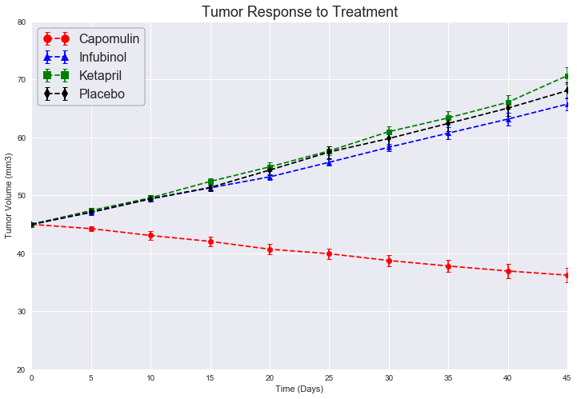
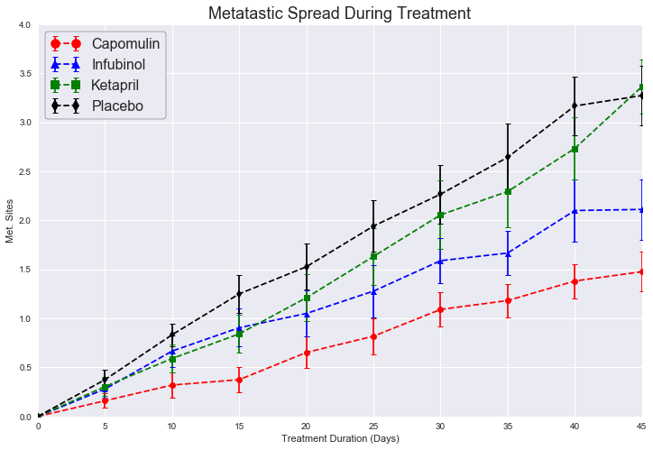
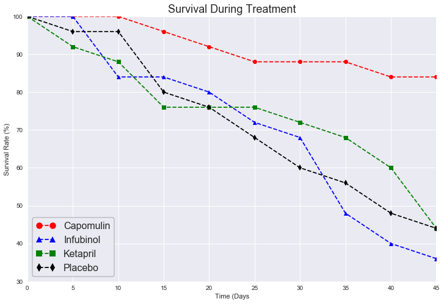
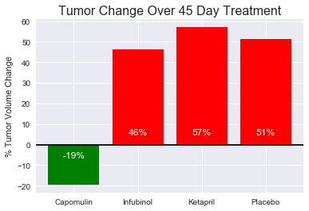

# Pymaceuticals, Inc.

### Analysis
* OBSERVED TREND 1: Capomulin was the only drug that displayed a downward trend with respect to tumor volume over time, with a decrease in tumor volume of 19% (tumor volume mean of 36.2 mm³ ± 1.2 after 45 days); the other three drugs displayed an upward trend. Placebo showed an increase in tumor volume of 51% (tumor volume mean of 68.1 mm³ ± 1.4 after 45 days.) Infubinol performed slightly better than placebo at +46% (tumor volume mean of 65.8 mm³ ± 1.1 after 45 days,) while Ketapril performed slightly worse than placebo at +57% (tumor volume mean of 70.7 mm³ ± 1.5 after 45 days.) 
* OBSERVED TREND 2: Capomulin showed the best results with respect to metastatic growth over time, with a mean of 1.48 metastatic sites, ± 0.2 after 45 days. Infubinol performed better than placebo, with a mean of 2.1 metastatic sites, ± 0.31 after 45 days. Placebo and Ketapril performed approximately the same, with means of 3.27 ± 0.3 and 3.36 ± 0.28 metastatic sites after 45 day, respectively. Coupled with the tumor volume over time results, it appears that Ketapril may be promoting tumor growth and metastasis rather than discouraging them, although the shape of the graph for Ketapril suggests that it may be suppressing metastasis early in treatment, as the number of metastatic sites did not catch up to and surpass those of the placebo group until the end of the 45 day test cycle.
* OBSERVED TREND 3: With regard to survival rates, each drug group began the test cycle at timepoint 0 with 25 mice. Capomulin had the best survival rate; at the end of 45 days, 21 mice survived in the Capomulin group (84%.) Both the placbo and Ketapril groups had 11 survivors at the end of 45 days (44%) The group with the lowest survival rate was the Infubinol group, with 9 mice surviving at the 45 day timepoint (36%.) Of note in the Infubinol group was a marked downturn in survival beginning around timepoint 30; half the remaining mice in the group died between timepoints 25 and 45. This finding is concerning because in terms of tumor growth and metastasis over time, Infubinol was the second most promising drug in this analysis.

#### Initial ETL (Extract, Transform, and Load)


```python
import os                                                                    # os library
```


```python
import numpy as np                                                           # numpy library
```


```python
import pandas as pd                                                          # pandas library
```


```python
import matplotlib.pyplot as plt                                              # pyplot module from matplotlib
```


```python
import seaborn as sns                                                        # seaborn library
```


```python
filename = 'clinicaltrial_data.csv'                                          # Clinical trial data file
```


```python
csv_clinical = os.path.join(".", "raw_data", filename)                       # Creates path to read data
```


```python
clin_trial_df = pd.read_csv(csv_clinical)                                    # Reads data from file
```


```python
filename = 'mouse_drug_data.csv'                                             # Mouse drug data file
```


```python
csv_mousedrug = os.path.join(".", "raw_data", filename)                      # Creates path to read data
```


```python
mou_drug_df = pd.read_csv(csv_mousedrug)                                     # Reads data from file
```


```python
# Combines data from the two dataframes -> Adds mouse data to clinical trial data on Mouse ID
# Didn't worry about the one mouse that was treated with two drugs (g989), because mouse was 
# excluded from targeted drug list. Trap? Mistake? Pet that someone was worried about?
combined_df = pd.merge(clin_trial_df, mou_drug_df, how='inner', left_on='Mouse ID', right_on='Mouse ID')
```


```python
combined_df.sort_values(by=['Timepoint'], inplace=True)                      # Sorts dataframe on Timepoint
```


```python
combined_df = combined_df.reset_index(drop=True)                             # Resets index on sorted dataframe
```


```python
combined_df.head()                                                           # Displays first 5 rows
```


<div>
<style>
    .dataframe thead tr:only-child th {
        text-align: right;
    }

    .dataframe thead th {
        text-align: left;
    }

    .dataframe tbody tr th {
        vertical-align: top;
    }
</style>
<table border="1" class="dataframe">
  <thead>
    <tr style="text-align: right;">
      <th></th>
      <th>Mouse ID</th>
      <th>Timepoint</th>
      <th>Tumor Volume (mm3)</th>
      <th>Metastatic Sites</th>
      <th>Drug</th>
    </tr>
  </thead>
  <tbody>
    <tr>
      <th>0</th>
      <td>b128</td>
      <td>0</td>
      <td>45.0</td>
      <td>0</td>
      <td>Capomulin</td>
    </tr>
    <tr>
      <th>1</th>
      <td>i635</td>
      <td>0</td>
      <td>45.0</td>
      <td>0</td>
      <td>Propriva</td>
    </tr>
    <tr>
      <th>2</th>
      <td>g791</td>
      <td>0</td>
      <td>45.0</td>
      <td>0</td>
      <td>Ramicane</td>
    </tr>
    <tr>
      <th>3</th>
      <td>w746</td>
      <td>0</td>
      <td>45.0</td>
      <td>0</td>
      <td>Propriva</td>
    </tr>
    <tr>
      <th>4</th>
      <td>r107</td>
      <td>0</td>
      <td>45.0</td>
      <td>0</td>
      <td>Propriva</td>
    </tr>
  </tbody>
</table>
</div>


```python
targeted_only_df = combined_df[(combined_df["Drug"] == 'Capomulin') |        # Dataframe for targeted drugs only
                               (combined_df["Drug"] == 'Infubinol') |        # Pipe (|) represents logical or
                               (combined_df["Drug"] == 'Ketapril') |
                               (combined_df["Drug"] == 'Placebo')
                              ]
```

#### Tumor Response to Treatment


```python
# Create two-column groupby dataframe for means
vals_trt_df = pd.DataFrame(targeted_only_df.groupby(['Drug', 'Timepoint']).mean()['Tumor Volume (mm3)'])
```


```python
# Create two-column groupby dataframe for standard error of means
errs_trt_df = pd.DataFrame(targeted_only_df.groupby(['Drug', 'Timepoint']).sem()['Tumor Volume (mm3)'])
```


```python
vals_trt_df.head()                                                           # Displays dataframe
```


<div>
<style>
    .dataframe thead tr:only-child th {
        text-align: right;
    }

    .dataframe thead th {
        text-align: left;
    }

    .dataframe tbody tr th {
        vertical-align: top;
    }
</style>
<table border="1" class="dataframe">
  <thead>
    <tr style="text-align: right;">
      <th></th>
      <th></th>
      <th>Tumor Volume (mm3)</th>
    </tr>
    <tr>
      <th>Drug</th>
      <th>Timepoint</th>
      <th></th>
    </tr>
  </thead>
  <tbody>
    <tr>
      <th rowspan="5" valign="top">Capomulin</th>
      <th>0</th>
      <td>45.000000</td>
    </tr>
    <tr>
      <th>5</th>
      <td>44.266086</td>
    </tr>
    <tr>
      <th>10</th>
      <td>43.084291</td>
    </tr>
    <tr>
      <th>15</th>
      <td>42.064317</td>
    </tr>
    <tr>
      <th>20</th>
      <td>40.716325</td>
    </tr>
  </tbody>
</table>
</div>


```python
errs_trt_df.head()                                                           # Displays dataframe
```


<div>
<style>
    .dataframe thead tr:only-child th {
        text-align: right;
    }

    .dataframe thead th {
        text-align: left;
    }

    .dataframe tbody tr th {
        vertical-align: top;
    }
</style>
<table border="1" class="dataframe">
  <thead>
    <tr style="text-align: right;">
      <th></th>
      <th></th>
      <th>Tumor Volume (mm3)</th>
    </tr>
    <tr>
      <th>Drug</th>
      <th>Timepoint</th>
      <th></th>
    </tr>
  </thead>
  <tbody>
    <tr>
      <th rowspan="5" valign="top">Capomulin</th>
      <th>0</th>
      <td>0.000000</td>
    </tr>
    <tr>
      <th>5</th>
      <td>0.448593</td>
    </tr>
    <tr>
      <th>10</th>
      <td>0.702684</td>
    </tr>
    <tr>
      <th>15</th>
      <td>0.838617</td>
    </tr>
    <tr>
      <th>20</th>
      <td>0.909731</td>
    </tr>
  </tbody>
</table>
</div>


```python
vals_trt_df = vals_trt_df.unstack(level = 'Drug')                             # Pivots on drug
vals_trt_df.columns = vals_trt_df.columns.get_level_values(1)                 # Column names from level 1 values
vals_trt_df                                                                   # Displays dataframe
```


<div>
<style>
    .dataframe thead tr:only-child th {
        text-align: right;
    }

    .dataframe thead th {
        text-align: left;
    }

    .dataframe tbody tr th {
        vertical-align: top;
    }
</style>
<table border="1" class="dataframe">
  <thead>
    <tr style="text-align: right;">
      <th>Drug</th>
      <th>Capomulin</th>
      <th>Infubinol</th>
      <th>Ketapril</th>
      <th>Placebo</th>
    </tr>
    <tr>
      <th>Timepoint</th>
      <th></th>
      <th></th>
      <th></th>
      <th></th>
    </tr>
  </thead>
  <tbody>
    <tr>
      <th>0</th>
      <td>45.000000</td>
      <td>45.000000</td>
      <td>45.000000</td>
      <td>45.000000</td>
    </tr>
    <tr>
      <th>5</th>
      <td>44.266086</td>
      <td>47.062001</td>
      <td>47.389175</td>
      <td>47.125589</td>
    </tr>
    <tr>
      <th>10</th>
      <td>43.084291</td>
      <td>49.403909</td>
      <td>49.582269</td>
      <td>49.423329</td>
    </tr>
    <tr>
      <th>15</th>
      <td>42.064317</td>
      <td>51.296397</td>
      <td>52.399974</td>
      <td>51.359742</td>
    </tr>
    <tr>
      <th>20</th>
      <td>40.716325</td>
      <td>53.197691</td>
      <td>54.920935</td>
      <td>54.364417</td>
    </tr>
    <tr>
      <th>25</th>
      <td>39.939528</td>
      <td>55.715252</td>
      <td>57.678982</td>
      <td>57.482574</td>
    </tr>
    <tr>
      <th>30</th>
      <td>38.769339</td>
      <td>58.299397</td>
      <td>60.994507</td>
      <td>59.809063</td>
    </tr>
    <tr>
      <th>35</th>
      <td>37.816839</td>
      <td>60.742461</td>
      <td>63.371686</td>
      <td>62.420615</td>
    </tr>
    <tr>
      <th>40</th>
      <td>36.958001</td>
      <td>63.162824</td>
      <td>66.068580</td>
      <td>65.052675</td>
    </tr>
    <tr>
      <th>45</th>
      <td>36.236114</td>
      <td>65.755562</td>
      <td>70.662958</td>
      <td>68.084082</td>
    </tr>
  </tbody>
</table>
</div>


```python
errs_trt_df = errs_trt_df.unstack(level = 'Drug')                            # Pivots on drug
errs_trt_df.columns = errs_trt_df.columns.get_level_values(1)                # Column names from level 1 values
errs_trt_df                                                                  # Displays dataframe
```


<div>
<style>
    .dataframe thead tr:only-child th {
        text-align: right;
    }

    .dataframe thead th {
        text-align: left;
    }

    .dataframe tbody tr th {
        vertical-align: top;
    }
</style>
<table border="1" class="dataframe">
  <thead>
    <tr style="text-align: right;">
      <th>Drug</th>
      <th>Capomulin</th>
      <th>Infubinol</th>
      <th>Ketapril</th>
      <th>Placebo</th>
    </tr>
    <tr>
      <th>Timepoint</th>
      <th></th>
      <th></th>
      <th></th>
      <th></th>
    </tr>
  </thead>
  <tbody>
    <tr>
      <th>0</th>
      <td>0.000000</td>
      <td>0.000000</td>
      <td>0.000000</td>
      <td>0.000000</td>
    </tr>
    <tr>
      <th>5</th>
      <td>0.448593</td>
      <td>0.235102</td>
      <td>0.264819</td>
      <td>0.218091</td>
    </tr>
    <tr>
      <th>10</th>
      <td>0.702684</td>
      <td>0.282346</td>
      <td>0.357421</td>
      <td>0.402064</td>
    </tr>
    <tr>
      <th>15</th>
      <td>0.838617</td>
      <td>0.357705</td>
      <td>0.580268</td>
      <td>0.614461</td>
    </tr>
    <tr>
      <th>20</th>
      <td>0.909731</td>
      <td>0.476210</td>
      <td>0.726484</td>
      <td>0.839609</td>
    </tr>
    <tr>
      <th>25</th>
      <td>0.881642</td>
      <td>0.550315</td>
      <td>0.755413</td>
      <td>1.034872</td>
    </tr>
    <tr>
      <th>30</th>
      <td>0.934460</td>
      <td>0.631061</td>
      <td>0.934121</td>
      <td>1.218231</td>
    </tr>
    <tr>
      <th>35</th>
      <td>1.052241</td>
      <td>0.984155</td>
      <td>1.127867</td>
      <td>1.287481</td>
    </tr>
    <tr>
      <th>40</th>
      <td>1.223608</td>
      <td>1.055220</td>
      <td>1.158449</td>
      <td>1.370634</td>
    </tr>
    <tr>
      <th>45</th>
      <td>1.223977</td>
      <td>1.144427</td>
      <td>1.453186</td>
      <td>1.351726</td>
    </tr>
  </tbody>
</table>
</div>


```python
sns.set()                                                                    # Switches to seaborn default display
```


```python
plt.figure(figsize = (12,8))                                                 # Sets plot options
plt.title('Tumor Response to Treatment', fontdict = {'fontsize': 18})
plt.xlabel('Time (Days)')
plt.ylabel('Tumor Volume (mm3)')
plt.xticks(np.arange(0, vals_trt_df.index.max()+3 , 5))
plt.xlim(0, vals_trt_df.index.max())
plt.ylim(20, 80, 10)
```


    (20, 80)


```python
markers = ['o', '^', 's', 'd']                                               # Specifies marker shape
```


```python
colors = ['r', 'b', 'g', 'k']                                                # Specifies line colors
```


```python
x_axis = vals_trt_df.index                                                   # sets x axis to df index
```


```python
counter = 0                                                                  # Counter for iterable items in loop
```


```python
for item in vals_trt_df.columns:                                             # Creates plots for each drug
    plt.errorbar(x_axis, 
                 vals_trt_df[item],  
                 errs_trt_df[item],
                 linestyle = '--', 
                 marker =  markers[counter], 
                 color =  colors[counter],
                 capthick = 1, 
                 capsize = 3)
    counter += 1
```


```python
lg = plt.legend(numpoints = 2,                                               # Sets legend options
                frameon = True, 
                markerscale = 1.5, 
                edgecolor = 'black', 
                fontsize = '16', 
                framealpha = 1)
```


```python
plt.show()                                                                   # Displays plot 
```





#### Metastatic Response to Treatment


```python
# Create two-column groupby dataframe for means
vals_mrt_df = pd.DataFrame(targeted_only_df.groupby(['Drug', 'Timepoint']).mean()['Metastatic Sites'])
```


```python
# Create two-column groupby dataframe for standard error of means
errs_mrt_df = pd.DataFrame(targeted_only_df.groupby(['Drug', 'Timepoint']).sem()['Metastatic Sites'])
```


```python
vals_mrt_df.head()                                                            # Displays dataframe
```


<div>
<style>
    .dataframe thead tr:only-child th {
        text-align: right;
    }

    .dataframe thead th {
        text-align: left;
    }

    .dataframe tbody tr th {
        vertical-align: top;
    }
</style>
<table border="1" class="dataframe">
  <thead>
    <tr style="text-align: right;">
      <th></th>
      <th></th>
      <th>Metastatic Sites</th>
    </tr>
    <tr>
      <th>Drug</th>
      <th>Timepoint</th>
      <th></th>
    </tr>
  </thead>
  <tbody>
    <tr>
      <th rowspan="5" valign="top">Capomulin</th>
      <th>0</th>
      <td>0.000000</td>
    </tr>
    <tr>
      <th>5</th>
      <td>0.160000</td>
    </tr>
    <tr>
      <th>10</th>
      <td>0.320000</td>
    </tr>
    <tr>
      <th>15</th>
      <td>0.375000</td>
    </tr>
    <tr>
      <th>20</th>
      <td>0.652174</td>
    </tr>
  </tbody>
</table>
</div>


```python
errs_mrt_df.head()                                                            # Displays dataframe
```


<div>
<style>
    .dataframe thead tr:only-child th {
        text-align: right;
    }

    .dataframe thead th {
        text-align: left;
    }

    .dataframe tbody tr th {
        vertical-align: top;
    }
</style>
<table border="1" class="dataframe">
  <thead>
    <tr style="text-align: right;">
      <th></th>
      <th></th>
      <th>Metastatic Sites</th>
    </tr>
    <tr>
      <th>Drug</th>
      <th>Timepoint</th>
      <th></th>
    </tr>
  </thead>
  <tbody>
    <tr>
      <th rowspan="5" valign="top">Capomulin</th>
      <th>0</th>
      <td>0.000000</td>
    </tr>
    <tr>
      <th>5</th>
      <td>0.074833</td>
    </tr>
    <tr>
      <th>10</th>
      <td>0.125433</td>
    </tr>
    <tr>
      <th>15</th>
      <td>0.132048</td>
    </tr>
    <tr>
      <th>20</th>
      <td>0.161621</td>
    </tr>
  </tbody>
</table>
</div>


```python
vals_mrt_df = vals_mrt_df.unstack(level = 'Drug')                             # Pivots on drug
vals_mrt_df.columns = vals_mrt_df.columns.get_level_values(1)                 # Column names from level 1 values
vals_mrt_df                                                                   # Displays dataframe
```


<div>
<style>
    .dataframe thead tr:only-child th {
        text-align: right;
    }

    .dataframe thead th {
        text-align: left;
    }

    .dataframe tbody tr th {
        vertical-align: top;
    }
</style>
<table border="1" class="dataframe">
  <thead>
    <tr style="text-align: right;">
      <th>Drug</th>
      <th>Capomulin</th>
      <th>Infubinol</th>
      <th>Ketapril</th>
      <th>Placebo</th>
    </tr>
    <tr>
      <th>Timepoint</th>
      <th></th>
      <th></th>
      <th></th>
      <th></th>
    </tr>
  </thead>
  <tbody>
    <tr>
      <th>0</th>
      <td>0.000000</td>
      <td>0.000000</td>
      <td>0.000000</td>
      <td>0.000000</td>
    </tr>
    <tr>
      <th>5</th>
      <td>0.160000</td>
      <td>0.280000</td>
      <td>0.304348</td>
      <td>0.375000</td>
    </tr>
    <tr>
      <th>10</th>
      <td>0.320000</td>
      <td>0.666667</td>
      <td>0.590909</td>
      <td>0.833333</td>
    </tr>
    <tr>
      <th>15</th>
      <td>0.375000</td>
      <td>0.904762</td>
      <td>0.842105</td>
      <td>1.250000</td>
    </tr>
    <tr>
      <th>20</th>
      <td>0.652174</td>
      <td>1.050000</td>
      <td>1.210526</td>
      <td>1.526316</td>
    </tr>
    <tr>
      <th>25</th>
      <td>0.818182</td>
      <td>1.277778</td>
      <td>1.631579</td>
      <td>1.941176</td>
    </tr>
    <tr>
      <th>30</th>
      <td>1.090909</td>
      <td>1.588235</td>
      <td>2.055556</td>
      <td>2.266667</td>
    </tr>
    <tr>
      <th>35</th>
      <td>1.181818</td>
      <td>1.666667</td>
      <td>2.294118</td>
      <td>2.642857</td>
    </tr>
    <tr>
      <th>40</th>
      <td>1.380952</td>
      <td>2.100000</td>
      <td>2.733333</td>
      <td>3.166667</td>
    </tr>
    <tr>
      <th>45</th>
      <td>1.476190</td>
      <td>2.111111</td>
      <td>3.363636</td>
      <td>3.272727</td>
    </tr>
  </tbody>
</table>
</div>


```python
errs_mrt_df = errs_mrt_df.unstack(level = 'Drug')                             # Pivots on drug
errs_mrt_df.columns = errs_mrt_df.columns.get_level_values(1)                 # Column names from level 1 values
errs_mrt_df                                                                   # Displays dataframe
```


<div>
<style>
    .dataframe thead tr:only-child th {
        text-align: right;
    }

    .dataframe thead th {
        text-align: left;
    }

    .dataframe tbody tr th {
        vertical-align: top;
    }
</style>
<table border="1" class="dataframe">
  <thead>
    <tr style="text-align: right;">
      <th>Drug</th>
      <th>Capomulin</th>
      <th>Infubinol</th>
      <th>Ketapril</th>
      <th>Placebo</th>
    </tr>
    <tr>
      <th>Timepoint</th>
      <th></th>
      <th></th>
      <th></th>
      <th></th>
    </tr>
  </thead>
  <tbody>
    <tr>
      <th>0</th>
      <td>0.000000</td>
      <td>0.000000</td>
      <td>0.000000</td>
      <td>0.000000</td>
    </tr>
    <tr>
      <th>5</th>
      <td>0.074833</td>
      <td>0.091652</td>
      <td>0.098100</td>
      <td>0.100947</td>
    </tr>
    <tr>
      <th>10</th>
      <td>0.125433</td>
      <td>0.159364</td>
      <td>0.142018</td>
      <td>0.115261</td>
    </tr>
    <tr>
      <th>15</th>
      <td>0.132048</td>
      <td>0.194015</td>
      <td>0.191381</td>
      <td>0.190221</td>
    </tr>
    <tr>
      <th>20</th>
      <td>0.161621</td>
      <td>0.234801</td>
      <td>0.236680</td>
      <td>0.234064</td>
    </tr>
    <tr>
      <th>25</th>
      <td>0.181818</td>
      <td>0.265753</td>
      <td>0.288275</td>
      <td>0.263888</td>
    </tr>
    <tr>
      <th>30</th>
      <td>0.172944</td>
      <td>0.227823</td>
      <td>0.347467</td>
      <td>0.300264</td>
    </tr>
    <tr>
      <th>35</th>
      <td>0.169496</td>
      <td>0.224733</td>
      <td>0.361418</td>
      <td>0.341412</td>
    </tr>
    <tr>
      <th>40</th>
      <td>0.175610</td>
      <td>0.314466</td>
      <td>0.315725</td>
      <td>0.297294</td>
    </tr>
    <tr>
      <th>45</th>
      <td>0.202591</td>
      <td>0.309320</td>
      <td>0.278722</td>
      <td>0.304240</td>
    </tr>
  </tbody>
</table>
</div>


```python
plt.figure(figsize = (12,8))                                                 # Sets plot options
plt.title('Metatastic Spread During Treatment', fontdict = {'fontsize': 18})
plt.xlabel('Treatment Duration (Days)')
plt.ylabel('Met. Sites')
plt.xticks(np.arange(0, vals_mrt_df.index.max()+3 , 5))
plt.xlim(0, vals_mrt_df.index.max())
plt.ylim(0, 4.0, 0.5)
```


    (0, 4.0)


```python
x_axis = vals_mrt_df.index                                                   # sets x axis to df index
```


```python
counter = 0                                                                  # Counter for iterable items in loop
```


```python
for item in vals_mrt_df.columns:                                             # Creates plots for each drug
    plt.errorbar(x_axis, 
                 vals_mrt_df[item],  
                 errs_mrt_df[item],
                 linestyle = '--', 
                 marker =  markers[counter],                                 # Defined in previous section
                 color =  colors[counter],
                 capthick = 1, 
                 capsize = 3)
    counter += 1
```


```python
lg = plt.legend(numpoints = 2,                                               # Sets legend options
                frameon = True, 
                markerscale = 1.5, 
                edgecolor = 'black', 
                fontsize = '16', 
                framealpha = 1)
```


```python
plt.show()                                                                   # Displays plot 
```





#### Survival Rates


```python
# Counts mice through study and displays dataframe
survivors_df = targeted_only_df.groupby(['Drug', 'Timepoint']).count()['Mouse ID']
survivors_df = survivors_df.unstack(level = 'Drug')
survivors_df
```


<div>
<style>
    .dataframe thead tr:only-child th {
        text-align: right;
    }

    .dataframe thead th {
        text-align: left;
    }

    .dataframe tbody tr th {
        vertical-align: top;
    }
</style>
<table border="1" class="dataframe">
  <thead>
    <tr style="text-align: right;">
      <th>Drug</th>
      <th>Capomulin</th>
      <th>Infubinol</th>
      <th>Ketapril</th>
      <th>Placebo</th>
    </tr>
    <tr>
      <th>Timepoint</th>
      <th></th>
      <th></th>
      <th></th>
      <th></th>
    </tr>
  </thead>
  <tbody>
    <tr>
      <th>0</th>
      <td>25</td>
      <td>25</td>
      <td>25</td>
      <td>25</td>
    </tr>
    <tr>
      <th>5</th>
      <td>25</td>
      <td>25</td>
      <td>23</td>
      <td>24</td>
    </tr>
    <tr>
      <th>10</th>
      <td>25</td>
      <td>21</td>
      <td>22</td>
      <td>24</td>
    </tr>
    <tr>
      <th>15</th>
      <td>24</td>
      <td>21</td>
      <td>19</td>
      <td>20</td>
    </tr>
    <tr>
      <th>20</th>
      <td>23</td>
      <td>20</td>
      <td>19</td>
      <td>19</td>
    </tr>
    <tr>
      <th>25</th>
      <td>22</td>
      <td>18</td>
      <td>19</td>
      <td>17</td>
    </tr>
    <tr>
      <th>30</th>
      <td>22</td>
      <td>17</td>
      <td>18</td>
      <td>15</td>
    </tr>
    <tr>
      <th>35</th>
      <td>22</td>
      <td>12</td>
      <td>17</td>
      <td>14</td>
    </tr>
    <tr>
      <th>40</th>
      <td>21</td>
      <td>10</td>
      <td>15</td>
      <td>12</td>
    </tr>
    <tr>
      <th>45</th>
      <td>21</td>
      <td>9</td>
      <td>11</td>
      <td>11</td>
    </tr>
  </tbody>
</table>
</div>


```python
plt.figure(figsize = (12,8))                                                  # Sets plot options
plt.title('Survival During Treatment', fontdict = {'fontsize': 18})
plt.xlabel('Time (Days')
plt.ylabel('Survival Rate (%)')
plt.xlim(0, survivors_df.index.max())
plt.ylim(30, 100, 10)
```


    (30, 100)


```python
x_axis = survivors_df.index                                                  # Sets x axis to df index
```


```python
counter = 0                                                                  # Counter for iterable items in loop
```


```python
for survivor in survivors_df:                                                # Creates plots for each drug
    y_values = survivors_df[survivor]/survivors_df.loc[0,survivor] * 100     # Calculates survival rate per timepoint
    plt.plot(x_axis, 
             y_values, 
             linestyle = '--',  
             marker = markers[counter],                                      # Defined in previous section
             color = colors[counter]
             )
    counter += 1
```


```python
lg = plt.legend(numpoints = 2,                                               # Sets legend options
                frameon = True, 
                markerscale = 1.5, 
                edgecolor = 'black', 
                fontsize = '16', 
                framealpha = 1)
```


```python
plt.show()                                                                   # Displays plot 
```





#### Summary Bar Graph


```python
# Calculates tumor volume change for each targeted drug
summary = (vals_trt_df.loc[45, :] - vals_trt_df.loc[0, :])/vals_trt_df.loc[0, :] * 100
summary                                                                      # Displays series
```


    Drug
    Capomulin   -19.475303
    Infubinol    46.123472
    Ketapril     57.028795
    Placebo      51.297960
    dtype: float64


```python
plt.title('Tumor Change Over 45 Day Treatment', fontdict = {'fontsize': 16}) # Sets plot options
plt.ylabel('% Tumor Volume Change')
plt.axhline(y=0, color = 'black')                                            # Adds horizontal line @ 0
xlabels = summary.index
plt.xticks(np.arange(len(xlabels)), xlabels)                                 # Creates labels from drug names
```


    ([<matplotlib.axis.XTick at 0xc383f28>,
      <matplotlib.axis.XTick at 0xc383b00>,
      <matplotlib.axis.XTick at 0xc371358>,
      <matplotlib.axis.XTick at 0xc3a0c50>],
     <a list of 4 Text xticklabel objects>)


```python
plt.bar(np.arange(4),                                                        # Creates plots for each drug
        summary, 
        # Colors each bar based on positive or negative values
        color = ['red' if summary[value] > 0 else 'green' for value in np.arange(len(xlabels))]
       )
```


    <Container object of 4 artists>


```python
counter = 0                                                                  # Counter for iterable items in loop
```


```python
for value in summary:                                                        # Creates values in plot
    if value < 0:                                                            # Positions values in plot
        y_point = -6.5
    else:
        y_point = 5
    plt.text(counter, y_point, str(int(value)) + '%', ha = 'center', color = 'white')
    counter += 1
```


```python
plt.show()                                                                   # Displays plot 
```




